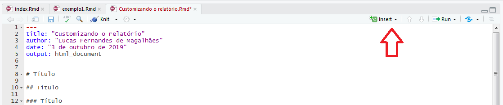

# Título

## Título

### Título

#### Título

&nbsp;
&nbsp;

## Formatar texto

&nbsp;
&nbsp;

Itálico: *teste*

Negrito: **teste**

## Incluir link

&nbsp;
&nbsp;

Enderenço de site: [nome do link](http://www.tjmg.jus.br/portal-tjmg/)


## Incluir Imagem

&nbsp;
&nbsp;

Imagem: 

&nbsp;
&nbsp;


&nbsp;
&nbsp;

## Personalizando o relatório

### Temas

Opções: "cerulean", "journal", "flatly", "darkly", "readable", "spacelab", "united", "cosmo", "lumen", "paper", "sandstone", "simplex", "yeti"

### Highlight

Opções: "tango", "pygments", "kate", "monochrome", "espresso", "zenburn", "haddock", "textmate"

## Chunks

&nbsp;
&nbsp;

Os códigos R são usados, em regra, dentro dos chunks. Praticamente todos os códigos rodados até então podem ser inseridos nos chunks. Uma exceção é a instalação de pacotes. 

Os chuncks podem ser inseridos usando o atalho Ctrl+Alt+i ou clicando no botão "insert":



&nbsp;
&nbsp;

```{r}
1+ 1
2+2
x <- 4
y <- 5
x+y
z <- "usar duas aspas e um r no início do código"
```


&nbsp;
&nbsp;

Também é possível usar o código R fora dos chunks. Para fazer isso, basta `r z`.

Por exemplo: `r 1+1`

&nbsp;
&nbsp;

## Modificando os chunks

&nbsp;
&nbsp;


```{r include = FALSE}
#library(tidyverse)
#library(rio)
```

```{r loading_packages, message = FALSE}
library(tidyverse)
library(rio)
library(kableExtra)
```

```{r echo=FALSE}
x <- rnorm(1000)
y <- rnorm(1000)
plot(x,y)
```


```{r echo=FALSE, fig.height = 8, fig.width = 4.5, fig.align = "center"}
x <- rnorm(1000)
y <- rnorm(1000)
plot(x,y)
```


```{r echo=FALSE, fig.height = 8, fig.width = 8, fig.align = "right"}
x <- rnorm(1000)
y <- rnorm(1000)
plot(x,y)
```

&nbsp;
&nbsp;

## Incluindo tabelas

&nbsp;
&nbsp;

```{r}
jn <- import("E:\\Curso R\\Aula 4\\jn.xlsx")
jn <- filter(jn,ano==2018)
jn <- select(jn, ano, sigla,uf_sede,regiao, g10a, g10b)
jn <- slice(jn, 1:5)
kable(jn)
```

&nbsp;
&nbsp;

```{r}
kable(jn) %>%
  kable_styling(bootstrap_options = c("striped", "hover"))
```

&nbsp;
&nbsp;

```{r}
kable(jn) %>%
  kable_styling("striped", full_width = F) %>%
  column_spec(2:3, bold = T) %>%
  row_spec(3:5, bold = T, color = "white", background = "#D7261E")
```

&nbsp;
&nbsp;

```{r}
kable(jn, caption="Tabela 1 - Dados do Justiça em Número") %>%
  kable_styling(c("striped", "bordered")) %>%
  add_header_above(c("Ano e Sigla" = 2, "Sede e região" = 2, "Salários de Magistrados e servidores" = 2)) %>%
  add_header_above(c("Data e região" = 4, "Salários" = 2)) %>%
  add_header_above(c("Dados do Justiça em Números" = 6))
```

&nbsp;
&nbsp;

## Matemática

&nbsp;
&nbsp;


<p style="font-size:30px;"> $$ f(x) = \sqrt{x^\frac{1}{2}}$$ </p>

&nbsp;
&nbsp;

<p style="border:3px; border-style:dashed; border-color:#FF4136; padding: 1em;font-size:30px;">
$$ e(s,J_3^0,J_3^2) =
  \begin{cases}
    1  & se \quad |s-J_3^2| \leq |s-J_3^0|\\
    0  & se \quad |s-J_3^2| > |s-J_3^0|\\
  \end{cases} $$ </p>